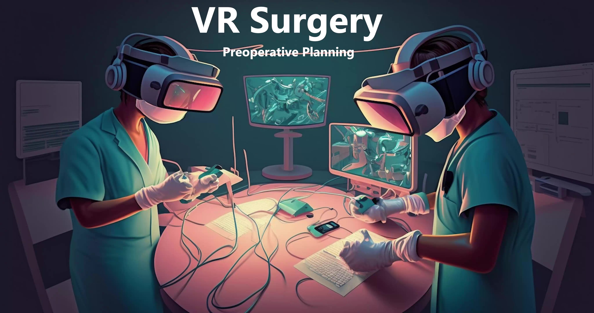

# VR Surgery Room

**A PIONEERING VR SURGERY SIMULATION EXPERIENCE DEVELOPED BY XREV STUDIO**

## About VR Surgery Room

Step into the cutting-edge VR Surgery Room, an immersive virtual reality environment where you can access detailed patient data, mark incision points, and manage patient records seamlessly. Designed for medical professionals and students, this tool offers a realistic and interactive approach to surgery planning and education.

## Details

### Description

- Engage in a groundbreaking virtual reality experience with the VR Surgery Room.
- Access comprehensive patient data and records within a virtual space.
- Mark incision points with precision and plan surgeries more effectively.
- Save and load patient data effortlessly, streamlining the preparation process for surgeries.
- Experience the future of medical training and surgery planning through virtual reality.
- Enhance your understanding and skills in surgery with our realistic simulations.

### Features

- **Real-time Patient Data Access**: Quickly retrieve detailed patient records and data.
- **Incision Point Marking**: Use VR tools to mark incision points accurately.
- **Save and Load Patient Data**: Easily save and access patient data for streamlined surgery planning.
- **Immersive VR Environment**: Step into a realistic VR surgery room for an unparalleled learning and planning experience.
- **Educational Tool**: A valuable resource for medical students and professionals to enhance their surgical knowledge and skills.

### Key Functionalities

- **Intuitive Controls**: Navigate through the VR environment and access tools with ease.
- **Data Management**: Efficiently manage and organize patient data for quick access during planning and procedures.
- **Collaborative Workspace**: Work together with other professionals in a virtual space, fostering collaboration and knowledge sharing.
- **Regular Updates**: Stay up-to-date with the latest advancements and features through regular updates.
- **Safety and Compliance**: Adhere to industry standards and regulations, ensuring a safe and compliant virtual environment.

## Gallery

## Links

- [Download on Playstore](link_to_google_play_store_page_of_app)
- [Official Website](link_to_website)
- [User Documentation](link_to_user_documentation)

---

© XRev Studio. All rights reserved.
